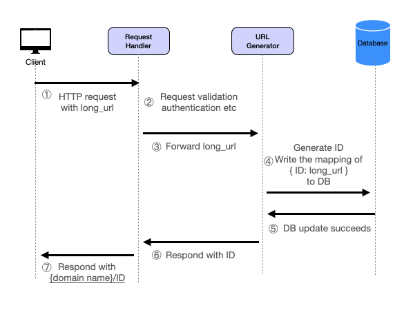
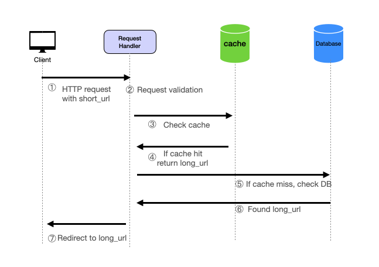
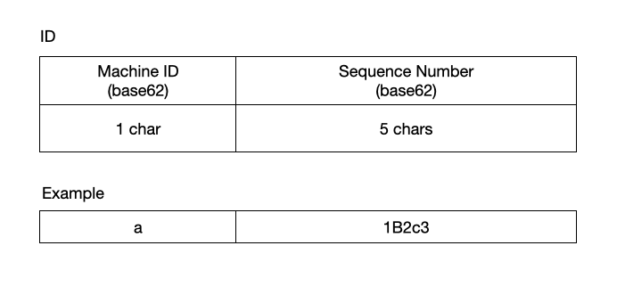
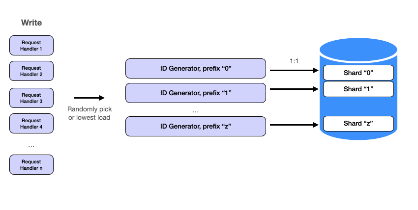
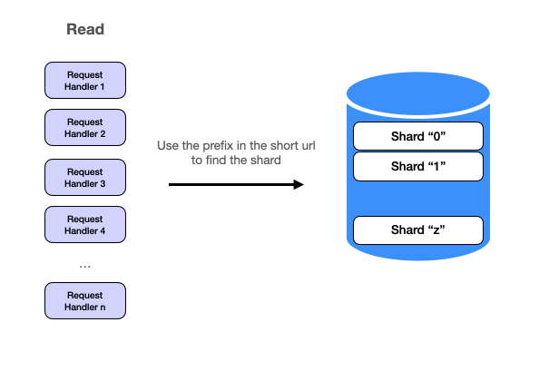

## Functional Requirements

- URL Shortening: Given a URL, the service should generate a shorter and unique alias of it. This is the core functionality of the service. The shortened URL should be unique across all users. The shortened URL should be as short as possible to save characters using only the English alphabet letters (a-z, A-Z) and digits (0-9).
- URL Redirection: If a user accesses a shortened URL, the service should redirect them to the original URL.
- Analytics: The service should be able to keep track of the number of times a short link has been accessed.

## Nonfunctional Requirements

Scale requirements:

- 100M Daily Active Users
- Read:write ratio = 100: 1
- Data retention for 5 years

Other requirements:

- High availability
- Low latency
- High durability
- Security

## Resource Estimation

The read to write ratio is 100:1, and considering a user base of 100 million daily active users, it implies that there are approximately 1 million write requests (URL shortening) and 100 million read requests (URL redirections) per day. We can use the [Resource Estimator] to capacity requirements.

### Traffic Estimates

With 1 million URL shortenings daily (write requests), we would have approximately 12 URL shortenings per second. For URL redirections (read requests), at a 100:1 ratio, we would have approximately 1,150 redirections per second.

### Storage Estimates

With each user shortening about one URL per day, and only 1 million users creating new URLs daily, we would add 1 million new entries every day. In 5 years, it's `1000000*365*5 ~= 1.8 billion` URLs. Assuming each entry is about 500 bytes (URLs + metadata), we would need about 500MB of new storage every day, or around 15GB per month.

### Bandwidth Estimates

If every write operation has an average size of 500 bytes, and there are 1 million write operations daily, we will have approximately 500MB of incoming data daily. For the read requests, given the 100:1 read to write ratio, there will be 100 million read requests daily. Therefore, the service will serve approximately 50GB of data daily for the read requests.

### Memory Estimates for Cache

If we want to cache some of the hot URLs that are frequently accessed, and let's say we want to cache 20% of daily read requests, we would need to cache 20 million URLs. Assuming each URL takes 500 bytes in memory, we would need about 10GB of memory.

## API Design

Our system can expose the following REST APIs:

URL shortening service (Write service)

```
POST /api/urls/shorten
```

Request Body:

```
{
  "longUrl": "http://example.com"
}
```

Response:

```
{
  "shortUrl": "http://urlshort.ly/abcd"
}
```

Redirection service (Read service)

```
GET /api/urls/{shortUrl}
```

Response:

```
{
    "longUrl": "http://example.com"
}
```

We can optimize the Redirection response by having the server responds with a [302 status code](https://en.wikipedia.org/wiki/HTTP_302) and includes the original long URL in the Location header. The client then automatically requests the original URL specified in the Location header. This makes the process seamless for the user, and they are redirected to the original URL without needing to manually request it

## High-Level Design

Our service can be split into two main paths: the write path for shortening a URL and the read path for redirecting to the original URL.


In both paths, we have an API gateways that handles the protocol translations, request routing, API composition, and other functions and a load balancer that handles scaling web servers. Given that the problem (as in most system design problems) exhibits distinct read and write scalability requirements, it's prudent to approach the design and discussion of these components separately.

#### Write Path



**Request Handler**

- Handles incoming HTTP requests from clients.
- Performs initial processing, such as validation, authentication, and checking the cache.
- May need to handle a high volume of requests with relatively low computational overhead.

**URL Generator**

- Responsible for generating unique shortened URLs and writing data to the database.
- Involves generating sequence numbers, encoding IDs, and interacting with the database.
- May have higher computational overhead per request compared to the Request Handler.

#### Read Path



**Request Handler**:

- Accepts a short URL from the requests and returns the original long URL.

------

> So far what we have is a simple high level design. Nothing particularly exciting here, mostly just cookie cutter stuff. You may have many questions about the details right now. Let's dive into detailed design where the hard questions in a more senior position interviews would come up.

A couple of immediate questions come to mind after coming up with the high level design:

- How to generates unique IDs in the short url for each request?
- How to scale the system to hundreds of millions of requests?

The second question depends on the first one, so let's tackle the first question first.

## Short URL ID Generator

The two properties we need for the IDs are:

1. It has to be globally unqiue across our system. We obviously do not want two long URLs to map the same the short URL.
2. It has to be "short". This is a relative concept. The URL shorteners used in production are around 5-8 characters long. For example, https://shorturl.at/xLMPr, https://t.ly/ecgGp and https://tinyurl.com/e9enh3uz.

The basic idea behind URL generation involves creating a **unique integer ID** for each URL, followed by **encoding** that ID into a shorter, human-readable format. Let's discuss each one in detail.


### Unique ID Generation

The process begins by generating a unique integer for each URL. Various methods can achieve this, each with its advantages and disadvantages. While these methods (e.g., hash functions, UUIDs) have their canonical formats (e.g., hex), they all ultimately produce byte arrays or large integers.

### Option 1: Hash Functions

Hash functions take input data and produce a fixed-size string of bytes. This output is typically a hexadecimal string that appears random.

- MD5

  : MD5 generates a 128-bit hash value. It's fast and widely used, but it's prone to collisions, making it unsuitable for applications requiring high security or uniqueness.

  - *Example*: `md5("https://example.com") = c984d06aafbecf6bc55569f964148ea3` or `267864437531868025902444334967583706787` in base 10.
  - *Collisions*: With MD5, there is a higher probability of two different inputs producing the same hash value (aka [hash collision](https://en.wikipedia.org/wiki/Hash_collision)), leading to potential conflicts.

- SHA256

  : SHA256 produces a 256-bit hash value and is more secure and collision-resistant than MD5.

  - *Example*: `e3b0c44298fc1c149afbf4c8996fb92427ae41e4649b934ca495991b7852b855` (64 characters) or `102987336249554097029535212322581322789799900648198034993379397001115665086549` in base 10.
  - *Security*: SHA256 is considered cryptographically secure, meaning it’s highly resistant to collisions and pre-image attacks. However, its long hash length makes it less practical for URL shortening.

To handle hash collision, we could use

- Longer Hashes: Use a hash function that produces a larger hash value. This will exponentially increase the number of possible hash values and decrease the likelihood of collisions. For example, using SHA-256 instead of MD5.
- Double Hashing: Apply a second hash function when a collision is detected. This requires keeping track of which keys have collided and may require additional storage.

Neither of these is ideal, and 128 bit is too long for our short URL.

### Option 2: UUID

[UUIDs](https://en.wikipedia.org/wiki/Universally_unique_identifier) (Universally Unique Identifiers) are standardized formats for generating unique identifiers. There are several versions, each with different generation mechanisms.

- *Details*: UUIDv1 uses the current timestamp and the MAC address of the machine. While it’s unique, it can leak information about when and where the UUID was generated.

- UUIDv4

  : Generates random values. It relies on randomness to ensure uniqueness, which means collisions are possible, though unlikely given a good random number generator.

  - *Example*: `f47ac10b-58cc-4372-a567-0e02b2c3d479`.
  - *Collision Probability*: The probability of a collision in UUIDv4 is extremely low, given the vast number of possible combinations (2^122). This makes it a reliable choice for many applications, though it results in a relatively long string.

The probability of duplicates for UUIDv4 generation is not zero. However, it is so low in practice it is considered to be negligible. This makes it a great choice for communication and dstributed database primary keys (e.g. [MongoDB](https://www.mongodb.com/docs/manual/reference/method/UUID/)). However, it suffers the same issues - it's also 32 characters, which is a bit too long for our URL "shortener" service.

### Option 3: Snowflake

Snowflake IDs are used to generate unique identifiers in distributed systems. They consist of a combination of a timestamp, machine ID, and sequence number.

- Structure

  :

  - **Timestamp**: 41 bits.
  - **Machine ID**: 10 bits.
  - **Sequence Number**: 12 bits.

- **Example**: `130267849091223552` (when converted to decimal).

- **Details**: Snowflake IDs are 64 bits long, which ensures uniqueness across distributed systems. The timestamp component ensures chronological order, while the machine ID and sequence number ensure uniqueness within a specific time frame.

This is currently what X uses as tweet ID. For example, this is one of Elon's tweets:

```
https://twitter.com/elonmusk/status/1811327840257761584
```

It's a base10 encoding of the snowflake ID. Let's decompose the tweet into binary components:

```
Binary Representation: 11001000110010001011111001100001000110011000001010101100000
Timestamp (41 bits): 11001000110010001011111001100001000110011
Datacenter ID (5 bits): 00001
Worker ID (5 bits): 00001
Sequence Number (12 bits): 010101100000
```

Snowflakes are unique and can be generated indepedently by each machine. The big downside for snowflake ID is again it is too long for a "short" URL.

### Option 4: Machine ID + Sequence Number (Chosen Solution)

This method uses a combination of a Machine(Shard) ID and a sequence number to generate unique IDs. It is similar to the Snowflake method but optimized for simplicity and brevity.

- **Machine(Shard) ID**: Identifies the machine generating the ID. This can be a fixed length prefix.

- **Sequence Number**: Ensures uniqueness within the shard. This is an auto-incrementing number within the shard.

- **Example**: If the Machine ID is `A1` and the sequence number is `0001`, the ID could be `A10001`.

- Benefits

  :

  - **Simplicity**: Easier to implement and understand compared to more complex algorithms.
  - **Efficiency**: Generates short and unique IDs, making it ideal for URL shortening.
  - **Scalability**: Can scale horizontally by adding more shards, each with its own unique prefix.

These options could be reordered to place the chosen solution at the top before discussing the alternatives, so people can find it immediately. We choose this design because we can control the length of machine ID and sequence number to fit our planned capacity. We will see the calculation after we discuss encoding.

## Encoding

Once we have a unique integer ID, the next step is to encode it into a human-readable and typeable string. This is crucial for creating short and user-friendly URLs.

### Option 1: Hex

Hexadecimal encoding is a common choice for representing binary data as a human-readable string.

- **Characters**: Uses `0-9` and `a-f`, making 16 possible characters.

- **Example**: The integer `123456` would be encoded as `1e240` in hex.

- Pros

  :

  - Widely recognized and used in many applications.
  - Simple and straightforward encoding.

- Cons

  :

  - Length: Hex strings are longer than necessary for URL shortening purposes. For instance, encoding a 64-bit integer in hex results in a 16-character string.

### Option 2: Base64

Base64 encoding is widely used for encoding binary data in URLs and emails.

- **Characters**: Uses `A-Z`, `a-z`, `0-9`, `+`, `/`, and `=`.

- **Example**: The integer `123456` would be encoded as `MTIzNDU2` in Base64.

- Pros:

  - More compact than hex, resulting in shorter strings.
  - Well-known and supported across various platforms.

- Cons:

  - Special characters (`+`, `/`, `=`) are hard to type and remember.

One base64 char encodes log2(64) = 6 bits of information.

### Option 3: Base62

The problem asks us to generate URLs as short as possible using English letters and numbers. This strongly suggest base62 encoding. Base62 encoding is a popular choice for URL shortening as it avoids special characters.

- **Characters**: Uses `0-9`, `A-Z`, and `a-z`, making 62 possible characters.

- **Example**: The integer `123456` would be encoded as `W7E` in Base62.

- Pros:

  - Shorter strings compared to hex and Base64.
  - No special characters, making it safe for use in URLs.

- Cons:

  - Slightly more complex encoding and decoding process since 62 is not a power of 2.

Here's a sample implementation for base62 encoding:

```
import string

# Characters for base62 encoding
CHARS = string.ascii_lowercase + string.ascii_uppercase + string.digits

def base62_encode(num):
    """Encodes a number using base62 encoding."""
    if num == 0:
        return CHARS[0]
    encoding = ''
    while num > 0:
        num, remainder = divmod(num, 62)
        encoding = CHARS[remainder] + encoding
    return encoding
```

One base64 char encodes `log2(64) = 6` bits of information, so one base62 char encodes `log2(62)` bits. e.g. for snowflake int64, it'll be `ceil(64 / log2(62)) = ceil(10.748721853250684) = 11` chars. This is clearly too long and this is why we have chosen Option 4 in the integer ID generation section.

For a base62 encoded string of length n, there are 62^n number of possible choices. For n = 5, `62^n ~=900 million`. For n = 6, `62^6 ~= 56 billion` which is much greater than the `1.8 billion` of URLs we calculated in the resource estimation section. Therefore a URL made up of base62 encoded string of length 6 should suffice to provide enough unique IDs to satisfy the requirement.

### Option 4: Base56

Base56 encoding is similar to Base62 but avoids potentially confusing characters.

- **Characters**: Omits characters like `I`, `l`, `1`, `o`, `O`, `0`, reducing the set to 56 characters.

- **Example**: The integer `123456` would be encoded as `jQc`.

- Pros:

  - Eliminates ambiguity, making it easier to read and type.

- Cons:

  - Slightly longer strings than Base62 due to fewer characters.

### Other Considerations

When designing a URL shortener, additional considerations might include avoiding the generation of offensive or undesirable words. This can be achieved by filtering out specific sequences during the encoding process, though this adds complexity to the algorithm. Another consideration is ensuring that the generated URLs are case-insensitive, which can further simplify usage but requires careful handling during encoding and decoding.

### ID Generator Final Design

Assuming we go with Option 4: Machine ID + Sequence Number for integer ID and Option 3: Base62 for encoding, we arrive at the following design:



From our calculation earlier, we know we can use 6 base62 characters to hold over 56 billion IDs. We can use 1 character for machine ID (which means 62 machines maximum) and the remaining 5 characters for the sequence number.

### Scaling with Sharding

With ID generation in place, the next step is to scale the system. Request handlers can be easily scaled as they function as independent HTTP servers. However, scaling the ID generator requires a bit more consideration.

### Machine ID (Prefix) as Shard Key

To horizontally scale the system, we need to shard the service. We already have a solution from the previous section: using 1 character for the machine ID. This "prefix" serves as the shard key for our ID Generator service. **By sharding the database and ID Generator using the same shard key, each machine corresponds to exactly one database shard**. This is a common design pattern. The approach ensures that write paths are completely independent and concurrent so we can scale the entire system by adding more servers without affecting existing ones.



The primary benefits of this approach:

**Scalability**: Adding more machines to the system is straightforward. Each new machine is assigned a unique prefix, allowing it to generate IDs and write to its own shard without impacting the existing setup. This allows the system to handle increased load seamlessly.

**Concurrency**: Independent write paths mean that multiple machines can perform write operations simultaneously without conflicting with each other. This parallelism enhances the system's overall throughput and efficiency.

Additionally, we also get some side benefits.

**Isolation**: Each machine and its corresponding database shard operate independently, minimizing the risk of system-wide failures. If one machine or shard encounters an issue, it does not affect the others, ensuring higher system reliability.

**Simplicity in Data Management**: With each machine handling a distinct shard, data management becomes simpler. Maintenance tasks such as backups, indexing, and scaling can be performed on individual shards without disrupting the entire system.

For the read request, if there is a cache miss, we can use the prefix in the short url to find the proper database shard to find the data. For example, if the short url is `a82c7w`, the request handler would go to shard `a` to find the long url. We could go even further to shard the cache using the same shard key if it becomes necessary



#### Scaling Request Handlers and ID Generator Independently

One question you may ask is why not make request handlers and ID generators 1:1 as well?

In general, the Request Handlers would likely need more machines compared to the URL Generation Service. This is due to the nature of their roles and the specific workloads they handle.

Request Handler Load:

- Primarily I/O bound (handling HTTP requests, checking cache, holding open sockets).
- May require more instances to handle high concurrency and low latency.

URL Generation Service Load:

- More CPU and I/O bound (generating IDs, writing to the database).
- May require fewer instances if each instance can handle a higher number of generation tasks efficiently.

In general, the Request Handlers would likely need more machines compared to the URL Generation Service. This is due to the nature of their roles and the specific workloads they handle. This is why we scale them differently. The request handlers can randomly pick an ID Generator machine to evenly distribute the load or pick the one with the lowest load if we want to use the more complex logic.

## Data Storage

We need a database that can efficiently support two operations: write operation (to store new short URLs), and read operation (to retrieve original URLs when given a short URL). We need a database that can scale well and offer good performance but do not need one that supports complex relationships.

Database Schema: Our database could be very simple, with a table containing the following fields:

```
id (unique identifier for each short URL, which can be an auto-incrementing number)
short_url (the unique shortened URL that we generate, indexed)
original_url (the original URL that the short URL maps to)
created_at (the timestamp when the URL was shortened)
access_count (how many times the short URL was accessed)
```

The short_url field will be used as the key for quick lookups when a user tries to access the original URL. The access_count field could be updated asynchronously using the analytics service to reduce the write load on the database.

### Database Type

The storage and access patterns are very simple. Any database with sharding should do. NoSQL database like Cassandra, DynamoDB or a SQL database like MySQL would be a suitable choice for our system. They are highly scalable with sharding and can handle high write/read loads.

### Database Sharding (Partitioning)

As described above, we will use machine ID prefix as the shard/partition key.

### Database Replication

We should also consider replicating our database for high availability and data durability. This will also help in distributing the read load across multiple servers.

### Data Retention and Cleanup

As per the requirement, we need to retain data for 5 years. We can have a separate service that periodically cleans up older data beyond this retention period. The service can be a batch job that run periodically to remove expired data or move them to a more cost-effective storage solution like a data lake or an object storage service, where it can be kept for long-term archival, analysis, or backup purposes.

Data Lake: A data lake is a storage repository that holds a large amount of raw data in its native format. Data lakes are excellent for big data analytics and machine learning, as well as archival purposes.

Examples of data lake solutions include Amazon S3 with AWS Athena, Google Cloud Storage with BigQuery, or Azure Data Lake Storage.

Object Storage: Object storage is another option for storing data. It is a cost-effective, scalable solution perfect for storing large amounts of unstructured data.

Examples of object storage solutions include Amazon S3, Google Cloud Storage, and Azure Blob Storage.

Data moved to these kinds of storage can still be accessed and analyzed if necessary, but at a much lower cost compared to keeping them in an active database.

### Caching

In addition to the database, we should also include a [caching] layer like Memcached or Redis is used to store hot URLs that are frequently accessed. This reduces the read load on the database and improves performance.

In a write-heavy workload like URL shortening, where the same short URL is unlikely to be requested many times in a quick succession, the benefits of caching might be less apparent. However, for URL redirection, where many requests could be made to the same short URL, a cache can significantly improve performance.

#### Cache Data Loading Pattern

Given your scenario, where the read-to-write ratio is high (10:1) and we don't know in advance which URLs will be most frequently accessed, a [cache-aside] strategy would likely be more effective.

With cache-aside (or lazy-loading), the data is only cached when it's requested, which means the cache naturally adapts to hold the most frequently requested URLs over time. This policy fits well with your high read-to-write ratio, as most of the data written to the cache will also be read frequently. And, the most accessed URLs will end up in the cache organically due to their higher access frequency.

#### Cache Eviction Policy

For cache eviction policy, A combination of LRU and TTL particularly useful. LRU will keep frequently accessed URLs in cache, ensuring quick responses for popular URLs, while TTL will ensure that the cache doesn't hold onto data that's not being accessed, freeing up space for other data.

### Rate Limiting

Rate limiting is implemented using a token bucket algorithm or similar method to limit the number of requests a user/IP can make in a certain time period.

### Analytics

Log data is stored in a separate data store for further analysis. This data can be used to generate useful statistics about the usage of our service.

Analytics would involve tracking and storing data each time a short URL is accessed. This data could include the timestamp, IP address, browser and OS information, and the short URL itself. This data could be stored in a database, and queries can be run to calculate the number of clicks, unique visitors, etc.

Given the high throughput of the URL redirection requests and the fact that we don't need analytics to be real time, it would be best to use an asynchronous, message-driven approach for processing analytics data. For example, each time a short URL is accessed, an event could be published to a message queue (like Kafka or RabbitMQ). Then, a separate analytics service could consume events from the queue and update the analytics database.

For real-time analytics, a stream processing system like Apache Flink or Spark Streaming could be used to process the events from the message queue and update the analytics in real-time.

To store and query the analytics data, a time-series database like InfluxDB or a NoSQL database like Cassandra might be appropriate, given their ability to handle high volumes of write operations and their support for time-based queries.

This system design ensures that the analytics processing doesn't block or slow down the core URL redirection functionality, and it also decouples the analytics functionality from the URL redirection, making the system more maintainable and scalable.

Please note that all of these strategies require additional infrastructure and could potentially increase the complexity of your system, so they should be evaluated against your specific requirements and constraints.

#### What about pre-generate unique IDs in bulk?

This is another way to handle high load. The behavior of the ID generator can be designed based on the requirements of the system and its expected load.

On-Demand Generation: If the load on the system is not very high, the ID generator can generate a unique ID for each new URL as requests come in. This has the advantage of simplicity and you are only generating as many IDs as needed, but it could become a bottleneck under high load.

Pre-generated IDs: Alternatively, the ID generator can pre-generate a batch of unique IDs periodically or when the system starts up, and then hand them out as needed. This has the advantage of being able to handle a sudden influx of requests, but you could end up generating more IDs than you need.

Hybrid Approach: A more complex approach would be to generate IDs in batches as requests come in. The ID generator could start with a batch of IDs, and then when it reaches a certain threshold (say 20% of IDs remaining), it could generate another batch. This combines the benefits of the above two methods. In a highly scalable URL shortening service where you might be dealing with a high number of requests per second, a pre-generated or hybrid approach might be more suitable. Remember to synchronize access to the batch of IDs in a thread-safe manner to avoid race conditions.

The specifics can vary depending on the unique ID generation strategy being used. For instance, X.com generates IDs on demand as it includes a timestamp and sequence number. On the other hand, Instagram's ID generation method pre-generates IDs using a combination of the current timestamp and an auto-incrementing sequence, where new IDs are fetched in batches from the database.